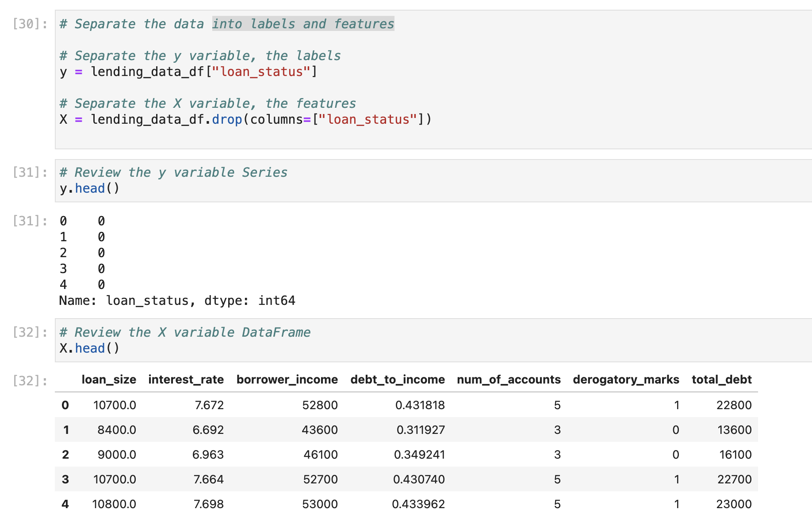
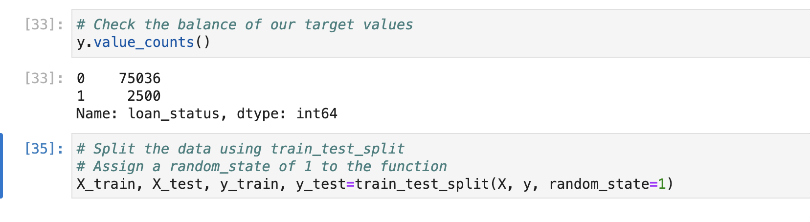
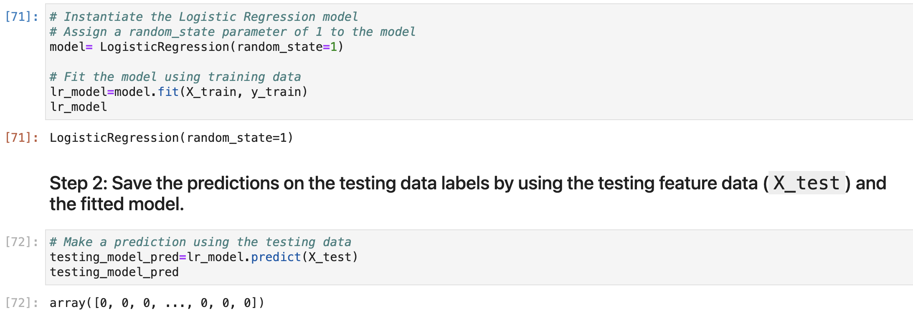
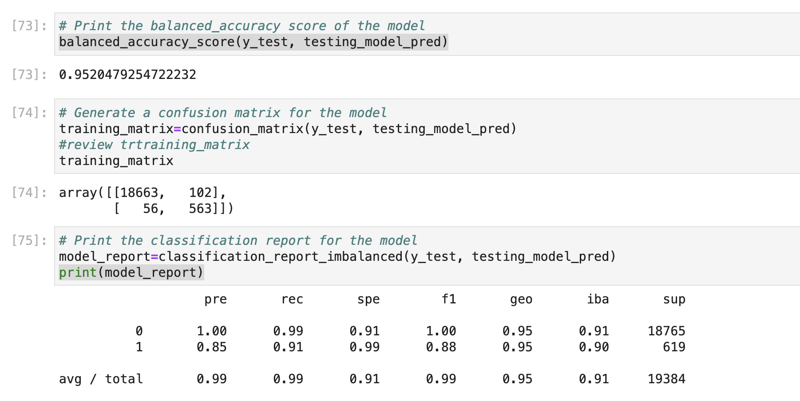
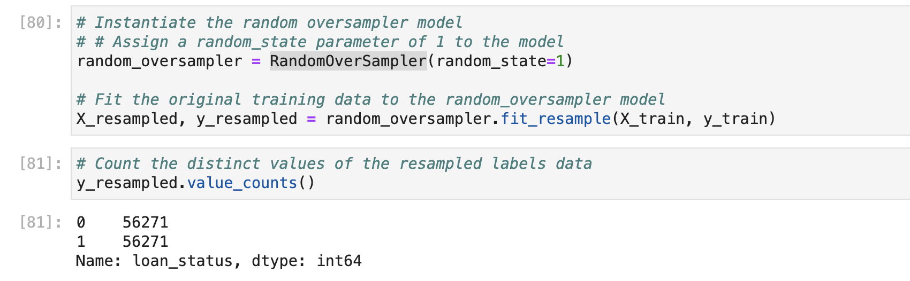
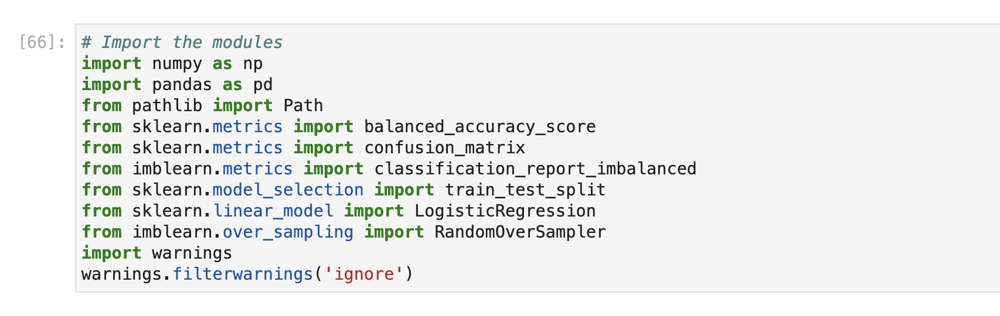

# Imbalanced Classes Classifiers
# Overview

This is a Jupyter notebook whose purpose is identify the Creditworthiness of borrowers by the creation of two machine learning models: one unbalanced and balanced with the financial information data provided in a dataset of historical lending activity from a peer-to-peer lending services company.

To predict this supervised binary classification problem. I was provided with a lending_data.csv file which was read by python and converted into a dataframe, with the creation of labels and features datasets. The labels variable (y) contains  "loan_status" column. A value of 0 in the “loan_status” column means that the loan is healthy. A value of 1 means that the loan has a high risk of defaulting., The features variable (X) contains the remaining columns of the dataframe. Then I check the balance of the variable (y) with the help of the value_counts function to check how balanced or unbalanced the variable was then I split the data in training and testing datasets with train_test_split. 

in the machine learning process I went through diferent stages as  fitting the model to the data, making predictions, and then evaluating the quality of those predictions using methods like LogisticRegretion to create a logistic regretion model and RandomOverSampler to resample the data. 

---

## Technologies

This setup assumes you already have conda installed.
This project leverages python 3.7 with the following packages:

---

## Contributors

Israel Fernandez

---
